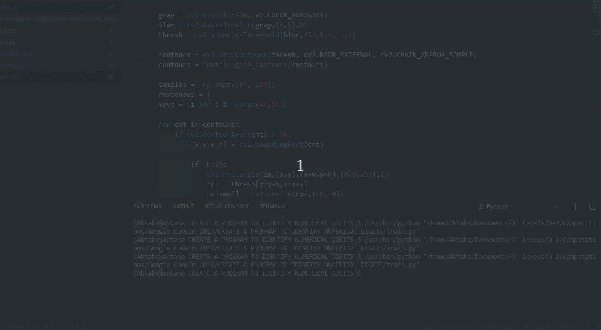

# Identify-Numerical-Digits-OpenCV
This repo contains the code for training and testing for the Numerical Digits Recognition problem

## Training

Change the image in the `training.py` to the image you want to train on. Run `training.py`.
When a number is circled with a bounding box, press that number's key.

## Testing

Type the input image when running `testing.py` to the image you want to test on. Run the file. The output will be shown accordingly.